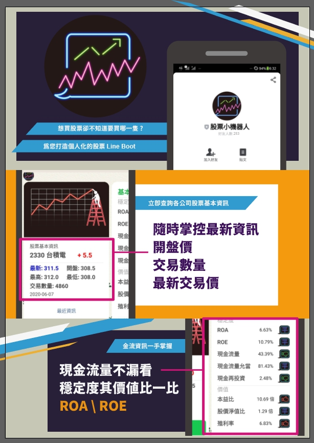

## 股票機器人 Line Bot
- 隨時掌控最新資訊
- 現金流量、公司健康不漏看
- 繪製三大法人、K線圖，提供買賣策略

## Python 工作內容 :
1. 使用 Flask 串接
1. 爬蟲股價趨勢、公司財報、三大法人以供繪製圖形
1. 製作 Flex Message 呈現使用者需要股票的健康資訊
1. 自動繪製圖形並上傳至 imagur，存入相關連結資訊供給 mongodb

